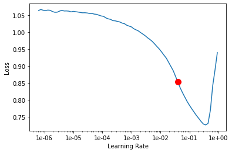

##  Planet Amazon - Multi-label classification

### Problem statement:

This is the competation hosted in [**Kaggle**](https://www.kaggle.com/c/planet-understanding-the-amazon-from-space). Forests are increasingly subjected to deforestation and degradation contributing to reduced biodiversity, habitat loss, climate change and other devastating effects with *Amazon* holding the largest share. Information about the location of deforestation and human encroachment on forests can help governments and local stakeholders respond more quickly and effectively. 

The objetive here is to use Machine Learning teqhniques to label satellite image with atmospheric conditions and various classes of land cover/land use. Hence, this is the *Multi-label classification* problem


### Data set description

Each Image can have multiple labels. The 'planet/train_v2.csv'file containing the labels we see that each 'image_name' is associated to several tags separated by spaces.

**sample of images and labels**

sl_no | image_name | labels (separated by space)
------|------------|-----
0 | train_0 | haze primary
1 | train_1 | agriculture clear primary water
2 | train_2 | clear primary
3 | train_3 | clear primary
4 | train_4 | agriculture clear habitation primary road

**data has 17 different labels:**
``` python
{'agriculture',
 'artisinal_mine',
 'bare_ground',
 'blooming',
 'blow_down',
 'clear',
 'cloudy',
 'conventional_mine',
 'cultivation',
 'habitation',
 'haze',
 'partly_cloudy',
 'primary',
 'road',
 'selective_logging',
 'slash_burn',
 'water'}
```

## Data Augmentation

Data Augumentation is the process of applying tranformations artificially to the data such as flipping, cropping, adding noise, lighting etc to make model robust to varying conditions.

The choice of transformations is problem and data specific. For example, transformations like horizontal flipping, vertical flipping etc are valid for satellite images where as tilting is not required and satellite captures image straight down.

I have used fastai default transformations settings except for four, mainly vertical flipping enabled.

``` python
tfms = get_transforms(flip_vert=True, max_lighting=0.1, max_zoom=1.05, max_warp=0.)
```

default parameters by Fastai: these parameters works well for most of the problems
``` python
transforms(
    do_flip: bool = True, #horizontal flipping
    flip_vert: bool = False, # vertical flipping
    max_rotate: float = 10.0, #rotate between -10 to +10 degrees
    max_zoom: float = 1.1, # random zoom between 1 and max_zoom(1.1)
    max_lighting: float = 0.2, # random lightning and contrast change controlled by max_lighting (0.2) is applied with probability p_lighting
    max_warp: float = 0.2, # controls view angle
    p_affine: float = 0.75, #probability that each affine transform and symmetric warp is applied
    p_lighting: float = 0.75,
    xtra_tfms: Union[Collection[fastai.vision.image.Transform], NoneType] = None, # user defined transforms
)
```

## Fastai data block API

Data block API allows user to customize creation of *Databunch*. 
``` python
src = (ImageList.from_csv(path, 'train_v2.csv', folder='train-jpg', suffix='.jpg')
       .split_by_rand_pct(0.2)
       .label_from_df(label_delim=' '))

data = (src.transform(tfms, size=128)
        .databunch().normalize(imagenet_stats))
```

```src``` is *ImageList* object that stores inputs such as image paths (read from csv) followed by random split (80:20) and split labels into multiple labels. Then applying tranformations in the ```tfms``` list, resizing image to 128 (w x h) after that. Finally, *Databunch* object is created normalized with **Imagenet** stats as we use **Resnet** model with pre-trained parameters trained using **Imagenet** dataset.

Note: Image size is kept small purposefully as model is trained in multiple steps. This allows model to learn fastly most of the features and also, prevent overfitting.


**visualize a random batch:**


## Training

### Metrics

**F2-Score**: *Planet Amazon competition* use *F2-Score* to determine the ranking so we will specify the F2-Score.

**accuracy**: Along with the above metric, we will also define measure *accuracy* as this is more interpretable then the other.

**customize metric funtion**

Last layer of the network outputs probability tensor of size equal to number of classes. Generally, for single class classification class corresponding to index of maximum probability is the precited class. Since, our is multiclass classification picking argmax is not enough we need to set a threshold and class probabilties  which exceed threshold value are all the predictions. Threshold value for both the metrics is chosen 0.2 as it more suitable for our problem.

### Create 'Learner' object

Learner is the fastai's trainer object. This is very handy and self-sufficient as it stores all the inputs, model architecture and utilities required for training within it. Training can initialized simply by calling ```Learner.fit```.

``` python
learn = cnn_learner(data, models.resnet50, metrics=[acc_02, f_score])
```

We initalize the ```cnn_learner``` object (sub class of ```learner``` suitable for CNN problem) with databunch: ```data```, model architecture: ```resnet50```(pretrained) and list of metrics to track.

for the Encoder, As we are using pre-trained weights trained on the Imagenet dataset consisting of images of 1000's of different objects which most likely includes objects found in our dataset. Therefore, the network doesn't need much tuning. However, we remove the last layer with 1000's of nodes and attach output layer suitable for our problem. This new layer needs more training. It is adviced to freeze the entrie network except for last layer then train it for some epoches to make it consistent with the layers behind it. Finally, unfreeze all the layers run model for few epoches  

### Fit

* **lr_finder** - Before jumping into model fit we need to select a optimal learing rate for our optimizer. *lr_finder* method will do a mock training by going over a large range of learning rates, then plot them against the losses. We will pick a value a bit before the minimum, where the loss still improves.



It is safe to choose ```lr``` of 0.01

* **fit_one_cycle** - Method is implementation of one cycle policy. lr goes up to max and comes down for one cycle of passing through all mini batches. In one fit cycle takes entire input and divides into batches of size 'bs'. then start with lr_min for the first batch increase gradually for next batches and when batch number reaches 30 percent of total batches, lr reaches lr_max and then starts going down and reaches lr_min again at last batch.

The original 1cycle policy has three steps:

* We progressively increase our learning rate from lr_max/div_factor to lr_max and at the same time we progressively decrease our momentum from mom_max to mom_min.
* We do the exact opposite: we progressively decrease our learning rate from lr_max to lr_max/div_factor and at the same time we progressively increase our momentum from mom_min to mom_max.
* We further decrease our learning rate from lr_max/div_factor to lr_max/(div_factor x 100) and we keep momentum steady at mom_max.


**schedule of the lrs (left) and momentum (right)**

### Stage1 (Freeze)

In first stage, model is trained with network freezed i.e only last layer weights allowed to be updated. Model was run with batch of 64 images for 4 epoches using ```Adam()``` optimizer with learning rate of 1e-02


epoch | train_loss | valid_loss | accuracy_thresh | fbeta | time
------|------------|------------|-----------------|-------|-----
0 | 0.133866 | 0.112550 | 0.948101 | 0.902924 | 06:47
1 | 0.107320 | 0.099688 | 0.955441 | 0.914089 | 01:41
2 | 0.098880 | 0.090975 | 0.957018 | 0.922234 | 01:41
3 | 0.092885 | 0.088278 | 0.955172 | 0.924335 | 01:42

### Stage2 (Unfreeze)

In the second stage, model is trained with entire model Unfreezed. Model was run with batch of 30 images for 5 epoches.


#### Discriminative Learning Rate

Since we are using pretrained model it is better to Lower learning rate for the earlier layers because they are near to an optimum label & to avoid overshooting. So, earlier layers are trained with 1e-5 ```lr``` where as last layer with 1e-04.

epoch | train_loss | valid_loss | accuracy_thresh | fbeta | time
------|------------|------------|-----------------|-------|-----
0 | 0.107826 | 0.094413 | 0.952760 | 0.916122 | 06:24
1 | 0.103481 | 0.091014 | 0.954664 | 0.921181 | 06:17
2 | 0.099292 | 0.090101 | 0.955085 | 0.922122 | 06:13
3 | 0.099089 | 0.089791 | 0.956611 | 0.922069 | 06:10
4 | 0.097972 | 0.089435 | 0.955615 | 0.922412 | 06:17

### Stage3

In stage3, image size is increased to ```256``` and batch size reduced to 30 with learning rate of 1-e04


epoch | train_loss | valid_loss | accuracy_thresh | fbeta | time
------|------------|------------|-----------------|-------|-----
0 | 0.086450 | 0.084866 | 0.958442 | 0.927094 | 06:22
1 | 0.078920 | 0.083003 | 0.959917 | 0.928001 | 06:08
2 | 0.084346 | 0.082829 | 0.959488 | 0.929076 | 06:08
3 | 0.080903 | 0.082124 | 0.959270 | 0.929806 | 06:08
4 | 0.082476 | 0.082216 | 0.960695 | 0.929906 | 06:10