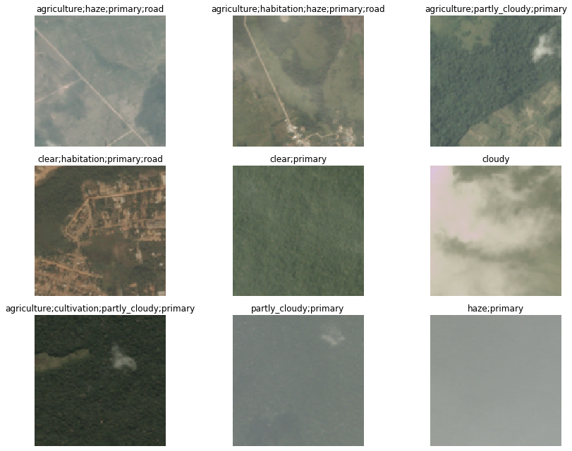

##  Multi-label prediction with Planet Amazon dataset

### Problem statement:

This is the competation hosted in [**Kaggle**](https://www.kaggle.com/c/planet-understanding-the-amazon-from-space). Forests are increasingly subjected to deforestation and degradation contributing to reduced biodiversity, habitat loss, climate change and other devastating effects with *Amazon* holding the largest share. Information about the location of deforestation and human encroachment on forests can help governments and local stakeholders respond more quickly and effectively. 

The objetive here is to use Machine Learning teqhniques to label satellite image with atmospheric conditions and various classes of land cover/land use. Hence, this is the *Multi-label prediction* problem

### Data set description

Each Image can have multiple labels. The 'planet/train_v2.csv'file containing the labels we see that each 'image_name' is associated to several tags separated by spaces.

sl_no | image_name | tags
------|------------|-----
0 | train_0 | haze primary
1 | train_1 | agriculture clear primary water
2 | train_2 | clear primary
3 | train_3 | clear primary
4 | train_4 | agriculture clear habitation primary road

